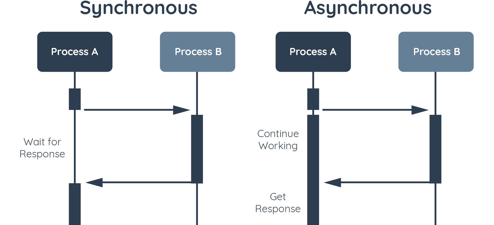

# Synchronous vs Asynchronous

Dalam synchronous program, kode dijalankan secara berurutan dari atas ke bawah. Artinya jika
kita menuliskan dua baris kode, maka baris kode kedua tidak bisa dieksekusi sebelum kode
baris pertama selesai. Kita bisa bayangkan ini dalam kehidupan nyata ketika mengantri
membeli kopi di sebuah kedai kopi. Kita tidak akan dilayani sebelum semua antrian di depan
kita selesai dilayani, begitu pula orang di belakang kita pun harus menunggu gilirannya.

Dalam asynchronous program, jika kita menuliskan dua baris kode, kita dapat membuat baris
kode kedua dieksekusi tanpa harus menunggu kode pada baris pertama selesai dieksekusi. Dalam
dunia nyata kita bisa membayangkan dengan memesan kopi, tetapi pemesanannya melalui pelayan.
Sembari menunggu pesannya datang, kita dapat melakukan aktivitas lain seperti membuka
laptop, menulis, hingga kopi itu datang dengan sendirinya.

Urutan di mana seseorang mendapatkan minumannya terlebih dahulu memiliki korelasi dengan
kapan ia memesan makanannya. Namun bukan hanya itu, faktor ini juga dipengaruhi dengan
minuman apa yang ia pesan. Contohnya jika kita memesan kopi espresso sedangkan teman kita
hanya memesan air mineral. Walaupun kita memesannya terlebih dahulu, tiada jaminan kita akan
mendapatkannya duluan. Membuat espresso tentu akan membutuhkan waktu lebih lama dibandingkan
dengan menuangkan air mineral pada gelas, kan?

Dalam program yang dijalankan secara asynchronous pun demikian. Task yang kecil akan lebih
dahulu selesai dibandingkan dengan task yang besar, meskipun task yang besar lebih dahulu
dijalankan.

Program asynchronous memungkinkan suatu operasi bisa berjalan sembari menunggu operasi
lainnya selesai. Umumnya kita memanfaatkan asynchronous pada operasi yang besar dan
membutuhkan waktu lama, seperti mengambil data dari internet atau API, menyimpan data ke
database, dan membaca data dari sebuah berkas.
