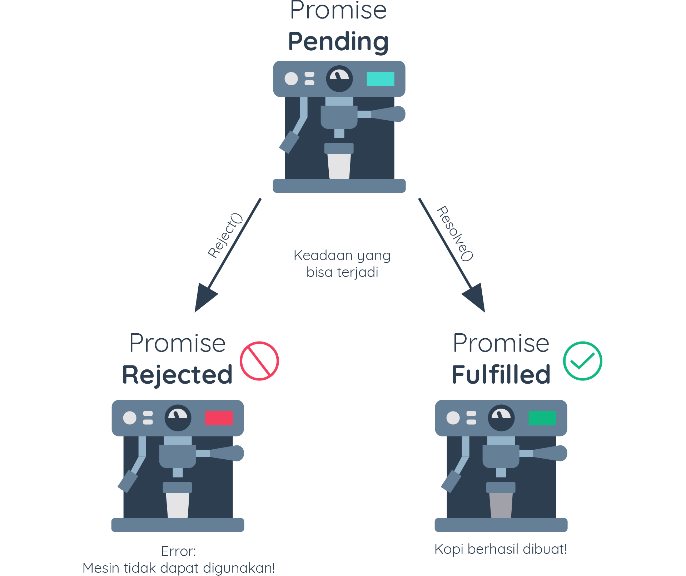

# Constructing Promise Object

Promise merupakan sebuah objek yang digunakan untuk membuat sebuah komputasi (kode)
ditangguhkan dan berjalan secara asynchronous [5]. Untuk membuat objek promise, kita gunakan
keyword new diikuti dengan constructor dari Promise:

```javascript
const coffee = new Promise();
```

Namun, jika kita jalankan kode tersebut akan mengakibatkan eror seperti ini:

```
TypeError: Promise resolver undefined is not a function
```

Di dalam constructor Promise, kita perlu menetapkan resolver function atau bisa disebut
executor function. Fungsi tersebut akan dijalankan secara otomatis ketika constructor
Promise dipanggil.

```javascript
const executorFunction = (resolve, reject) => {
    const isCoffeeMakerReady = true;
    if (isCoffeeMakerReady) {
        resolve("Kopi berhasil dibuat");
    } else {
        reject("Mesin kopi tidak bisa digunakan");
    }
}
 
 
const makeCoffee = () => {
    return new Promise(executorFunction);
}
const coffeePromise = makeCoffee();
console.log(coffeePromise);
 
 
/* output
Promise { 'Kopi berhasil dibuat' }
*/
```

Executor function memiliki dua parameter, yaitu resolve dan reject yang berupa fungsi.
Berikut penjelasan detailnya:

- resolve() adalah parameter pertama pada executor function. Parameter ini merupakan fungsi
yang dapat menerima satu parameter. Biasanya kita gunakan untuk mengirimkan data ketika
promise berhasil dilakukan. Ketika fungsi ini terpanggil, kondisi Promise akan berubah dari
pending menjadi fulfilled.

- reject() adalah parameter kedua pada executor function. Parameter ini merupakan fungsi
yang dapat menerima satu parameter dan digunakan untuk memberikan alasan kenapa Promise
tidak dapat terpenuhi. Ketika fungsi ini terpanggil, kondisi Promise akan berubah dari
pending menjadi rejected.

Executor function akan berjalan secara asynchronous hingga akhirnya kondisi Promise berubah
dari pending menjadi fulfilled/rejected.

Pada contoh kode di atas, outputnya akan seperti ini:

```javascript
/* output
Promise { 'Kopi berhasil dibuat'  }
*/
```

Kenapa demikian? Executor function mengeksekusi resolve() dengan membawa data string “Kopi
berhasil dibuat”. Jika kita ubah nilai dari variabel isCoffeeMakerReady menjadi false, maka
executor function akan mengeksekusi reject() dengan membawa pesan penolakan “Mesin kopi
tidak bisa digunakan”.

```javascript
/* output
Promise { <rejected> 'Mesin kopi tidak bisa digunakan' }
*/
```



Dalam praktik aslinya, Promise digunakan untuk menjalankan proses asynchronous seperti
mengambil data dari internet/API. Hasil permintaan data dapat terpenuhi atau mengalami
kegagalan.

Output yang dihasilkan baik ketika fulfilled ataupun rejected masih berupa Promise, bukan
nilai yang dibawa oleh fungsi resolve atau reject. Lantas bagaimana kita bisa mengakses
nilai yang dibawa oleh fungsi-fungsi tersebut? Caranya adalah menggunakan method .then()
yang tersedia pada objek Promise.


