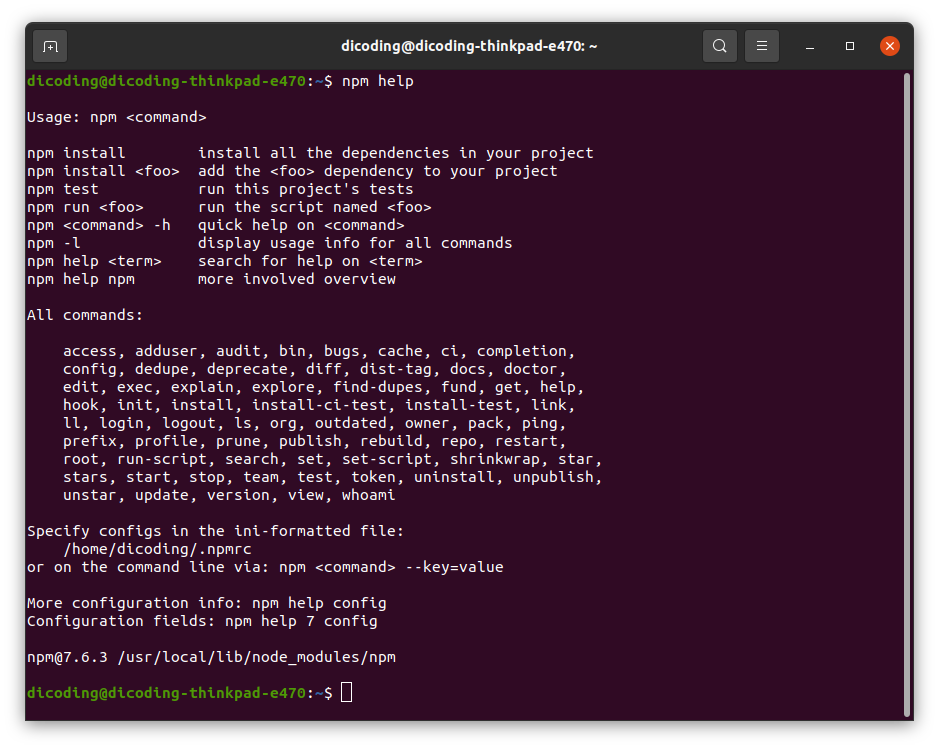
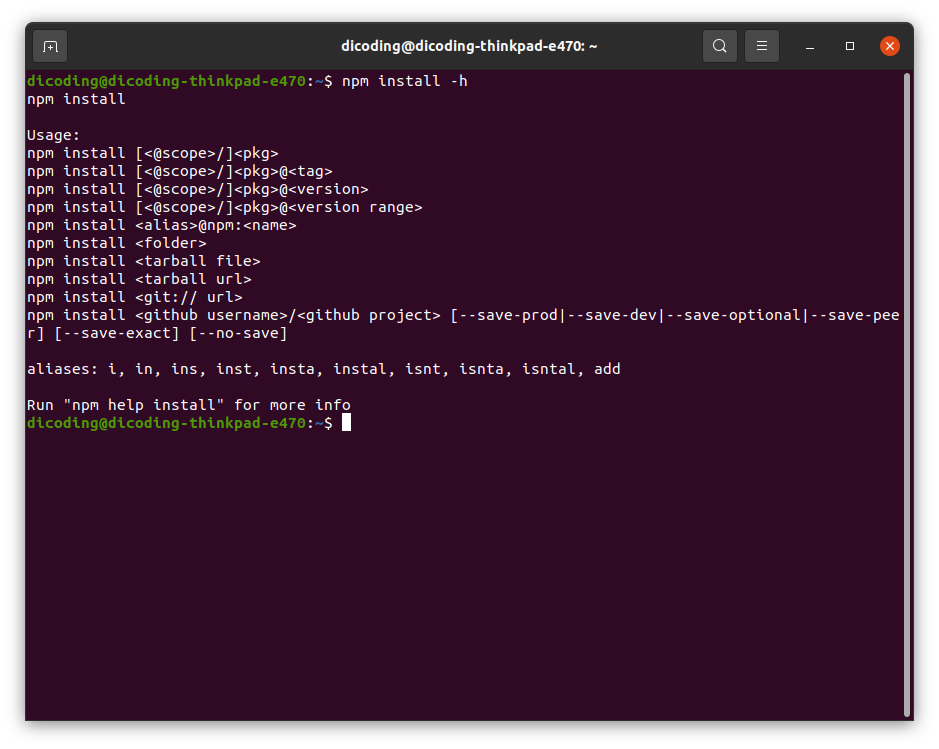

# Getting Started with NPM

Semakin kompleks suatu aplikasi, semakin banyak pula package yang digunakan. Di sinilah kita
memerlukan sebuah package manager. Package manager merupakan tools yang dapat membantu
pengelolaan package pada proyek agar lebih mudah. Kita dapat dengan mudah memasang dan
menghapus package yang dibuat oleh orang lain pada proyek kita. Selain itu, kita juga dapat
menulis module/package untuk dikonsumsi secara publik.

Hampir setiap bahasa pemrograman populer memiliki package manager-nya masing-masing. Java
memiliki Maven dan Gradle, PHP memiliki Composer, dan Python memiliki pip. Lalu bagaimana
dengan JavaScript? Tentu JavaScript juga punya! NPM adalah salah satu package manager yang
banyak digunakan oleh JavaScript developer dalam mengelola package, selain NPM ada juga Yarn
Package Manager.

Keduanya, baik yarn atau npm, merupakan package manager yang dapat membantu kita dalam
mengembangkan aplikasi web atau node. Namun, pada materi ini kita hanya akan membahas salah
satu package managernya saja, yaitu NPM. Hal tersebut karena NPM merupakan package manager
standar yang disediakan Node.js.

Node Package Manager (NPM) merupakan pengelola package untuk JavaScript yang dapat memudahkan
kita dalam mengelola package yang tersedia pada https://www.npmjs.com/. NPM ini merupakan
standard package manager yang disediakan oleh Node.js dan otomatis terpasang ketika memasang
Node.js pada komputer kita.

Berbicara mengenai package, sebelumnya kita sudah membuat dan mengetahui fungsi module pada
JavaScript. Dengan module kita dapat berbagi kode JavaScript untuk digunakan pada berkas yang
berbeda. Bahkan, melalui NPM kita dapat menggunakannya pada proyek yang berbeda. Dalam arti
lain, package yang tersedia pada NPM adalah sebuah module.

Dalam menggunakan NPM kita dapat menulis perintah pada terminal (Linux/macOS) atau command
prompt/PowerShell (Windows). Ada banyak command yang tersedia pada NPM. Untuk melihat
daftarnya, kita dapat menjalankan perintah npm help pada terminal/command prompt.



Lalu gunakan -h jika kita ingin melihat panduan penggunaan salah satu perintahnya. Contoh, Anda
ingin melihat detail cara penggunaan perintah install, maka untuk melihatnya tuliskan perintah
berikut:

```javascript
npm install -h
```

Hasilnya adalah panduan dalam penggunaan perintah install.



-h dapat digunakan tidak hanya pada perintah install, tetapi juga pada seluruh perintah yang
ada pada NPM.

Jika melihat panduan pada gambar di atas, kita bisa menemukan beberapa “aliases”. Aliases atau
alias merupakan cara lain dalam melakukan perintah tersebut. Itu berarti perintah install dapat
kita tuliskan dengan i, ins, isntal, add, atau yang lainnya.

```javascript
npm install
npm i
npm in
npm ins
npm isntal
npm add
 
// semua perintah di atas memiliki fungsi yang sama
```

Alias ini dapat berupa cara cepat (shortcut) dan juga kesalahan pengejaan yang umum (install →
isntall). Hal tersebut sangat membantu developer agar lebih cepat dalam menuliskan sebuah
perintah di command line.

Anda bisa mendapatkan penjelasan lengkap mengenai seluruh perintah yang ada di NPM pada laman
resmi berikut: https://docs.npmjs.com/cli/v7/commands. Namun, terdapat beberapa perintah
penting yang akan biasa kita gunakan dalam materi dan juga pengembangan aplikasi selanjutnya.

| Command                  | Description                                                  | Common Options                                               |
| ------------------------ | ------------------------------------------------------------ | ------------------------------------------------------------ |
| init                     | Membuat berkas package.json pada project                     | [--force \| -f \| --yes \| -y \| --scope]                    |
| install <package-name>   | Memasang dan mendaftarkan package pada berkas package.json   | [-P \| --save-prod \| -D \| --save-dev \| -O \| --save-optional ] [ -E\| --save-exact ] [ -B \| --save-bundle ] [ --no-save ] [ --dry-run ] |
| run-script <command>     | Menjalankan perintah yang terdapat pada objek scripts di berkas package.json | [--silent] [-- <args>...]                                    |
| uninstall <package-name> | Menghapus dan mengeluarkan package dari berkas package.json  | [ -S \| --save \| -D \| --save-dev \| -O \| --save-optional \| --no-save ] |
| version                  | Untuk melihat versi package yang tersedia secara global atau lokal | [ <newversion> \| major \| minor \| patch \| premajor \| preminor \| prepatch \| prerelease [--preid=<prerelease-id>] \| from-git] |


