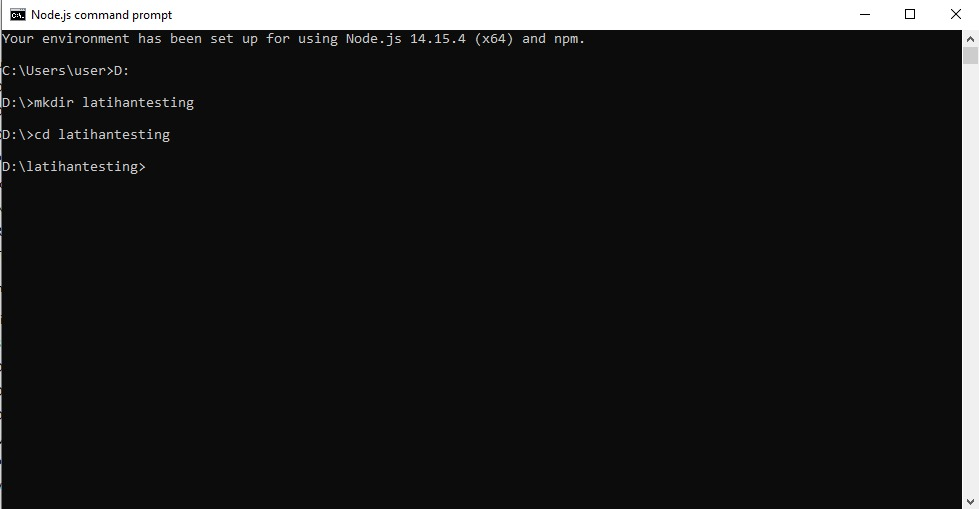
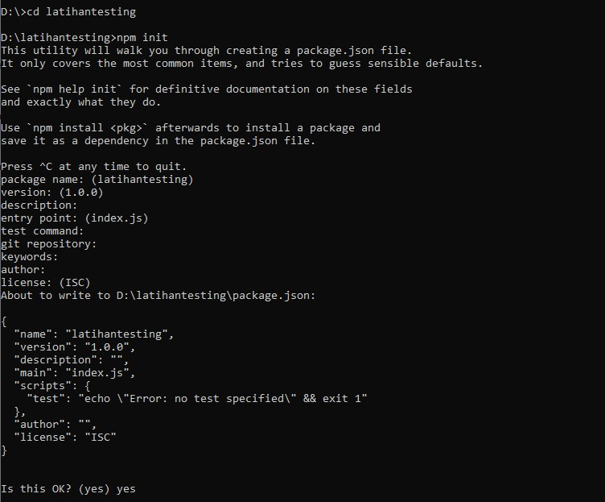
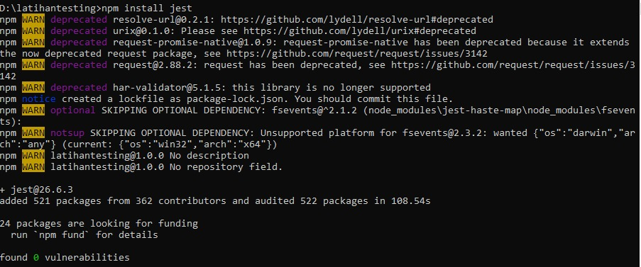

# Jest

Dalam penulisan kode pengujian, kita dapat menggunakan library tambahan untuk mempermudah
penulisan kode pengujian.

Jest merupakan salah satu framework testing paling populer untuk menuliskan kode pengujian pada
bahasa pemrograman JavaScript. Jest dapat digunakan untuk menuliskan script testing pada
aplikasi backend maupun frontend.

Kita akan mencoba untuk menuliskan sebuah kode pengujian menggunakan framework jest.

1. Membuat proyek baru dengan direktori bernama latihantesting.




2. Setelah masuk ke direktori tersebut, kita dapat melakukan init project kita.



3. Setelah proyek tersebut diinisialisasi. Selanjutnya kita dapat melakukan instalasi library
   framework jest.

```bash
npm install --save-dev jest
```




4. Setelah proses instalasi selesai, buka proyek di code editor.

5. Pada file package.json, kita tambahkan script untuk test dengan cara menambahkan baris kode
   berikut:

```javascript
{
  "scripts": {
    "test": "jest"
  }
}
```

6. Penambahan script tersebut digunakan agar kita bisa menjalankan script test yang nanti kita
   buat menggunakan runner.


