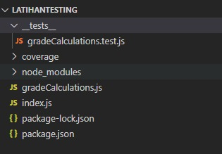
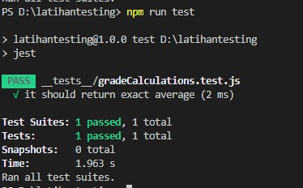

# Pengujian Kode

Kita telah mempelajari bentuk penulisan script test menggunakan Jest. Selanjutnya, kita akan
membuat 2 buat fungsi untuk pengujian kode berdasarkan proyek yang sudah dibuat di materi
sebelumnya. Perhatikan urutan langkahnya di bawah ini.

Buatlah file bernama gradeCalculations.js dalam folder latihantesting.

```javascript
const averageExams = (valuesExam) => {
    const numberValidation = valuesExam.every(exam => typeof exam === 'number');
    if (!numberValidation) throw Error('please input number');
 
    const sumValues = valuesExam.reduce((accumulator,currentValue) => accumulator + currentValue, 0);
    return sumValues / valuesExam.length;
};
 
const isStudentPassExam = (valuesExam, name) => {
    const minValues = 75;
    const average = averageExams(valuesExam);
    
    if (average > minValues) {
        console.log(`${name} is fail the exams`);
        return true;
    } else {
        console.log(`${name} is pass the exams`);
        return false;
    }
};
 
module.exports = { averageExams, isStudentPassExam };
```

Kode di atas terdapat 2 fungsi:

- averageExams : Menghitung rata-rata nilai siswa dari sebuah inputan berupa daftar angka dalam
bentuk array.

- isStudentPassExam : Melakukan kalkulasi apakah seorang siswa lulus ujian atau tidak berdasarkan
nilai rata-rata yang didapatkan (bergantung pada fungsi averageExams).

Dari kedua contoh kode di atas, kita akan melakukan simulasi pengujian unit test & integration
test.

Penulisan kode pengujian dapat dilakukan dengan memulai kerangka testcase yang sudah kita
singgung diatas.

- Apa yang akan diuji?
	- Fungsi menghitung rata-rata.
	- Fungsi untuk mengecek apakah seorang siswa lulus ujian.

- Ekspektasi yang diharapkan?
	- Menghasilkan nilai yang sesuai dari inputan.
	- Inputan harus berupa angka.
	- Menghasilkan hasil kelulusan iya/tidak pada siswa dengan nilai kriteria tertentu.

Setelah kita menuliskan contoh kode gradeCalculations.js, hal yang perlu dilakukan  pada
penulisan kode pengujian menggunakan jest adalah sebagai berikut:

- Simpan script test dalam sebuah folder bernama __tests__.
- 1 file test untuk 1 lingkup perintah dengan format namaScopeFunctions.test.js.



Dari contoh di atas maka semua testcase dari gradeCalculations ditulis di dalam
gradeCalculations.test.js.

Penulisan unit test untuk kode averageExams sebagai berikut:

```javascript
const { averageExams } = require('../gradeCalculations');
 
test('it should return exact average', () => {
    const listValueOfExams = [80, 100, 100, 80];
    expect(averageExams(listValueOfExams)).toEqual(90);
})
```

Untuk menjalankan kode pengujian tersebut, dapat menjalankan perintah runner yang sudah kita
buat sebelumnya.

```bash
npm run test
```



Dari contoh di atas, kita dapat melihat bahwa test case tersebut sesuai ekspektasi. Selain itu,
kita juga dapat membuat multiple case dengan membuat tes yang lain, misalnya dengan kode
berikut:

```javascript
test('it should handle non-number ', () => {
    const listValueOfExams = [80, 'a', '100', 80];
    expect(() => averageExams(listValueOfExams)).toThrow();
})
```

Integration test dapat dijalankan ataupun ditulis bersamaan dengan unit test. Sehingga kita
dapat melakukan grouping dari contoh kode diatas menjadi sebagai berikut:

```javascript
const { averageExams, isStudentPassExam } = require('../gradeCalculations');
 
describe('grade calculations', () => {
    test('it should return exact average', () => {
        const listValueOfExams = [80, 100, 100, 80];
        expect(averageExams(listValueOfExams)).toEqual(90);
    });
 
    /**
     * Integration testing
     */
    test('it should return exam passed status', () => {
        const listValueOfExams = [80, 100, 100, 80];
        expect(isStudentPassExam(listValueOfExams, 'Budi')).toEqual(true);
    })
 
 
    test('it should return exam failed status', () => {
        const listValueOfExams = [50, 40, 70, 80];
        expect(isStudentPassExam(listValueOfExams, 'Budi')).toEqual(false);
    })
})
```

Setelah menuliskan semua test case yang ada, dengan jest kita dapat melihat laporan kode yang
sudah terdapat pengujian dengan cara sebagai berikut:

```bash
npm run test -- --coverage
```

Setelah prosesnya selesai, jest akan secara otomatis men-generate laporan pengujian dalam
folder coverage. Dalam folder tersebut terdapat:

- index.html berisi laporan test secara keseluruhan (1 proyek).
- fungsiDiTest.js.html berisi laporan test per kode pengujian.


