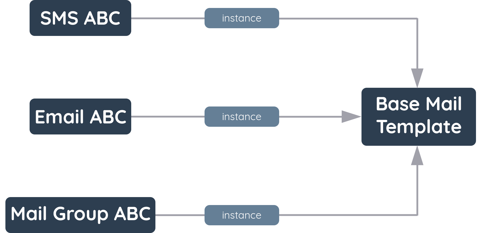

# Introduction to OOP

Object Oriented Programming (OOP) adalah salah satu paradigma dalam dunia pemrograman komputer. Ia
adalah pendekatan berbasis objek, di mana suatu objek terdiri dari kumpulan atribut dan method di
dalamnya. Di dalam JavaScript, atribut adalah variabel yang digunakan untuk menyimpan nilai.
Sementara method adalah fungsi yang digunakan untuk menjalankan suatu proses.

Untuk lebih mudah memahami apa itu OOP, kita bisa menggunakan pemodelan hal-hal dunia nyata ke
dalam program yang kita buat. Ambil contoh Kucing, ia berperan sebagai objek. 

Kita ibaratkan ada seekor yang kucing memiliki karakteristik bulunya berwarna kuning, tinggi badan
23 cm, dan juga berat badan 4kg. Kucing tersebut juga memiliki kemampuan khusus yaitu mampu
berlari, melompat, dan juga tidur.

 Nah, dalam konteks OOP, karakteristik kucing (warna bulu, tinggi badan, dan berat badan) merupakan
atribut dari suatu objek kucing, ia adalah nilai-nilai yang dimiliki oleh seekor kucing. Sedangkan
kemampuan (berlari, melompat, tidur) adalah method dari seekor kucing, ia adalah suatu aktivitas
yang bisa dilakukan oleh seekor kucing.

JavaScript memiliki kapabilitas untuk membuat program dengan menerapkan paradigma OOP. Meskipun ada
beberapa perbedaan dan perdebatan mengenai OOP di JavaScript dengan yang ada di bahasa pemrograman
lain.

Sebelumnya kita sudah mengenal dan mempelajari object yang dapat merepresentasikan sebuah layer
data. Jika string dianalogikan sebagai kata (kumpulan karakter), number sebagai angka, dan boolean
sebagai pernyataan benar atau salah; maka object dianalogikan sebagai sebuah benda yang lebih
kompleks. OOP pun sama, tetapi lebih kompleks lagi karena di dalam paradigma OOP terdapat 4 pilar
utama, yaitu encapsulation, abstraction, inheritance, dan polymorphism.

Sebagai contoh, kita memiliki sebuah data object bernama mail seperti contoh di bawah ini.

```javascript
const mail = {
    from: "pengirim@dicoding.com",
		  sendMessage: function (msg, to) {
        console.log(`you send: ${msg} to ${to} from ${this.from}`);
    
		  }

};
 
console.log(mail.from);
mail.sendMessage('apakabar', 'penerima@dicoding.com');
 
/**
output:
you send: apakabar to penerima@dicoding.com from pengirim@dicoding.com
**/
```

Object di atas memiliki atribut dengan tipe data string (from) dan sebuah fungsi atau method untuk
mengirim pesan (sendMessage). Selain itu kita juga dapat mengubah isi dari salah satu atribut dari
objek tersebut. Contohnya:

```javascript
mail.from = "pengirim2@dicoding.com";
```

Atau, menambahkan sebuah fungsi baru bernama saveContact.

```javascript
mail.saveContact = function(addr) {
  console.log(`email saved ${addr}`);

}
```

Contoh di atas adalah penulisan dengan gaya format object literal, yaitu penulisan object dengan
langsung menuliskan key dan value-nya dalam Object yang dibuat. Hal-hal tersebut belum sepenuhnya
merangkum konsep object dalam OOP.

Lalu, di benak Anda muncul beberapa pertanyaan sebagai berikut:

1. Bagaimana jika saya ingin membuat objek baru bernama mail2 dengan atribut yang sama namun nilai
   yang berbeda dengan mail? Apakah harus mendefinisikan attribute dan function/method yang sama
secara berulang?

2. Bagaimana jika saya ingin membuat mail2 tanpa method saveContact?

3. Bagaimana jika saya ingin menambahkan fungsi tambahan pada mail2?

Dari tiga pertanyaan di atas, maka fungsi paradigma OOP dapat menjadi solusi dikarenakan memiliki 4
pilar yang sudah disebutkan sebelumnya. Sederhananya kita akan membuat base template dari sebuah
object, kemudian dari base tersebut kita dapat meng-instansiasi dalam bermacam bentuk objek. Di
bawah ini adalah gambaran di mana Mail adalah base template dan sms, email, mailgroup adalah
instansiasi dari Mail.



Contoh lainnya, misalkan base template dari sebuah object adalah Animal dan dapat merepresentasikan
berbagai bentuk misalkan aves, mamalia, pisces, dll. Untuk membuat base template tersebut, maka
kita akan mempelajari Class terlebih dahulu.


