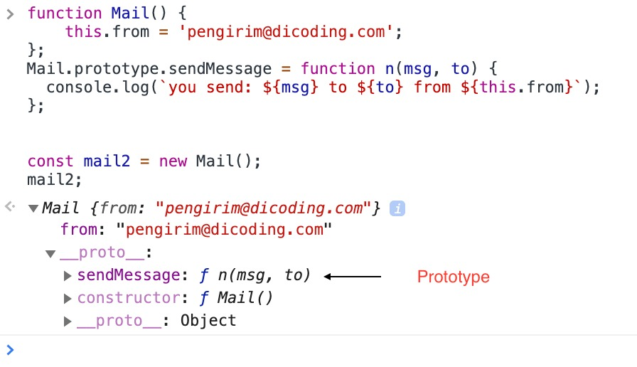
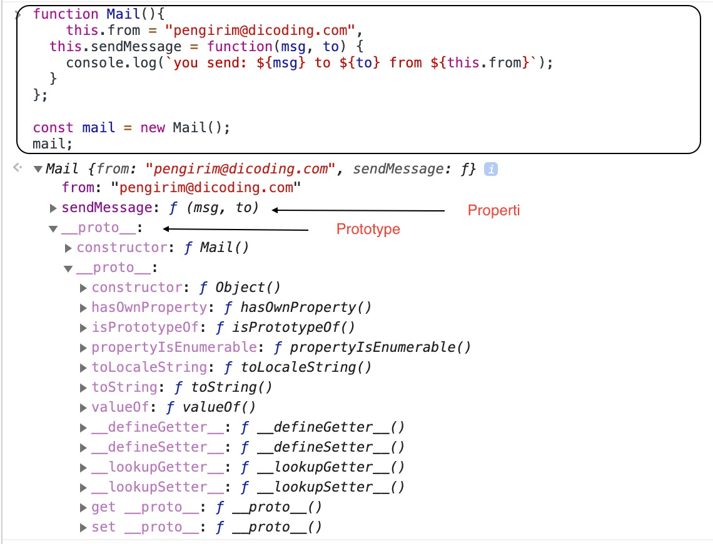

# Class

Class adalah hal yang sangat penting dalam pemrograman berorientasi objek. Hal itu karena class
menyediakan informasi tentang suatu object. Jadi dapat dikatakan object adalah instance dari sebuah
class. Class sendiri dalam paradigma OOP secara teknis merupakan sebuah blueprint dalam
mendefinisikan karakteristik dari sebuah objek. Sebagai contoh, misalkan terdapat blueprint untuk
mendefinisikan objek Mail. Yang mana sms dan postman adalah object dari class Mail.

Nama Class			= Mail
Karakteristik		= pengirim, penerima, isi pesan
Kapabilitas/aksi	= kirim pesan, terima pesan

Di dalam sebuah class, dapat terdiri dari properti dan method. Properti merupakan karakteristik
dari class, sedangkan method adalah kapabilitas atau kemampuan yang dimiliki oleh class.

Nah, untuk penulisan class di JavaScript sendiri bisa menggunakan dua cara, yakni melalui sintaks
function ataupun class.

Mari kita lihat dulu cara membuat class menggunakan sintaksis function.


Function: menggunakan pendekatan prototype

```javascript
function Mail() {
    this.from = 'pengirim@dicoding.com';

};
 
Mail.prototype.sendMessage = function n(msg, to) {
  console.log(`you send: ${msg} to ${to} from ${this.from}`);

};
```

Function: tanpa pendekatan prototype

```javascript
function Mail(){
    this.from = "pengirim@dicoding.com",
  	this.sendMessage = function(msg, to) {
    console.log(`you send: ${msg} to ${to} from ${this.from}`);
  } 
};
```

```javascript
// pemanggilan
 
const mail1 = new Mail();
mail1.sendMessage('hallo', 'penerima@dicoding.com');
 
/**
output:
you send: hallo to penerima@dicoding.com from pengirim@dicoding.com
**/

```

Perbedaan:




Cara pertama memiliki 2 pendekatan:

- Penulisan method menggunakan prototype
- Penulisan method sebagai sebuah properti secara umum

Cukup berbeda dengan bahasa pemrograman lain pada umumnya, JavaScript memiliki konsep bernama
prototype. Prototype adalah properti internal yang akan selalu ada ketika sebuah objek dibuat. Dari
kedua pendekatan tersebut, pemanggilan terhadap properti dapat dilakukan dengan cara yang sama. Namun,
penerapan prototype lebih dianjurkan. Lihatlah sintaksis dibawah ini.


```javascript
// menggunakan prototype
const mail = new Mail();
mail.hasOwnProperty('sendMessage');
// hasilnya = false
 
--------
 
// tanpa prototype
const mail = new Mail();
mail.hasOwnProperty('sendMessage');
// hasilnya = true
```

Ketika kita meng-instantiate objek-objek lain, objek yang menggunakan prototype tidak meng-copy
atribut sendMessage ke setiap objek-objek. Berbeda ketika kita tidak menggunakan prototype, semua
attribute di-copy ke setiap objek. Dengan demikian, penggunaan prototype dapat menghemat alokasi
memori yang digunakan.

Lanjut ke cara kedua, yakni menggunakan sintaksis class.

```javascript
// Cara 2
class Mail {
	constructor() {
        this.from = 'pengirim@dicoding.com';
    
	}
 
	sendMessage(msg, to) {
        console.log(`you send: ${msg} to ${to} from ${this.from}`);
    
	};

}
 
const mail1 = new Mail();
mail1.sendMessage('hallo', 'penerima@dicoding.com');
 
/**
output:
you send: hallo to penerima@dicoding.com from pengirim@dicoding.com
**/
```

Cara kedua pada dasarnya menggunakan prototype, penggunaan sintaksis class pada javascript hanyalah
syntatic sugar dari prototype itu sendiri. Demikianlah cara umum yang digunakan untuk menuliskan dan
menginstansiasi objek dari sebuah Class.


