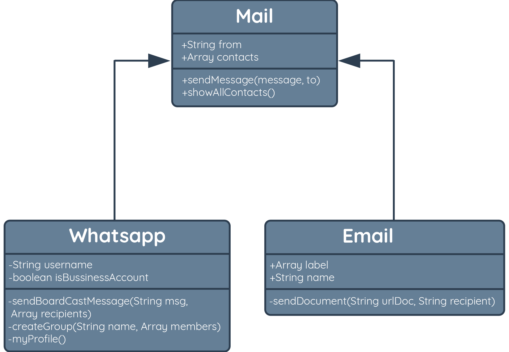

# 4 Pilar OOP

Seperti yang sempat kita singgung pada awal modul OOP, terdapat empat pilar dalam OOP, yaitu encapsulation, abstraction, inheritance, dan polymorphism.

## Encapsulation

Enkapsulasi adalah kondisi di mana attribute atau method di dalam class dibungkus dan bersifat
privat. Artinya objek lain tidak bisa mengakses atau mengubah nilai dari property secara
langsung. Pada contoh kasus Mail kita tidak bisa langsung mengubah daftar contact, namun kita
bisa menambahkannya melalui fungsi saat kirim pesan atau mengambil data tersebut melalui method
showAllContacts.


```javascript
class Mail{
	constructor(author) {
        this._contacts = [];
        this.from = author;
    
	}
	sendMessage = function(msg, to) {
        console.log('you send:', msg, 'to', to, 'from', this.from);
        this._contacts.push(to);
    
	}
	showAllContacts() {
        return this._contacts;
    
	}

}
```

## Abstraction

Abstraksi dapat dikatakan merupakan penerapan alami dari enkapsulasi. Abstraksi berarti sebuah
objek hanya menunjukkan operasinya secara high-level. Misalnya kita cukup tahu bagaimana
bagaimana pesan dikirim atau diterima, namun kita tidak perlu tahu seperti apa proses enkripsi
dan dekripsi isi pesan, atau bagaimana sebuah daftar contact dapat bertambah.

## Inheritance

Beberapa objek bisa memiliki beberapa karakteristik atau perilaku yang sama, tetapi mereka
bukanlah objek yang sama. Di sinilah inheritance atau pewarisan berperan. SMS dan jenis pesan
lainnya memiliki karakteristik umum yang dimiliki juga oleh jenis pesan lainnya, seperti
memiliki konten pesan, alamat/nomor pengirim, alamat/nomor penerima, dsb. Maka dari itu, Email
sebagai objek turunan (subclass) mewarisi semua sifat dan perilaku dari objek induknya
(superclass) Mail. Begitu juga dengan objek Whatsapp juga mewarisi sifat dan perilaku yang sama.
Namun, whatsapp bisa membuat grup, mengirim broadcast message sedangkan Email tidak.



Dari contoh di atas, misalkan kita ingin membuat 2 (dua) child class yaitu WhatsApp dan Email.
Maka dalam JavaScript cara menuliskan pewarisan terdapat 2 cara, yaitu sebagai berikut:

```javascript
// cara 1: menggunakan keyword `extends` jika menggunakan statement `class`
class ChildClassName extends ParentClassName{}
 
 
// cara 2: menggunakan `prototype` jika menggunakan statement `function` / `class`
ChildClassName.prototype = new ParentClassName()
```

Misalkan kita akan membuat sebuah child class bernama WhatsApp yang mewarisi kelas Mail. Maka
contoh kodenya adalah sebagai berikut:

```javascript
class Mail {
    constructor(author) {
        this.from = author;
        this._contacts = [];
    }
    sendMessage(msg, to) {
        console.log(`you send: ${msg} to ${to} from ${this.from}`);
        this._contacts.push(to);
    }
    showAllContacts() {
        return this._contacts;
    }
}

class WhatsApp extends Mail {
    constructor() {
        super();
        this.username = 'dicoding';
        this.isBussinessAccount = true;
    }
    myProfile() {
        return `my name ${this.username}, is ${this.isBussinessAccount ? 'Business' : 'Personal'}`;
    }
}

const wa1 = new WhatsApp(080111000222);
console.log(wa1.myProfile());
// my name dicoding, is Business
```

Kita juga dapat mengakses attribute maupun method dari parent class yang Accessible. Misalkan:

```javascript
wa1.sendMessage('halo', 089000999888);
```

## Polymorphism

Polymorphism dalam bahasa Yunani berarti “banyak bentuk”. Sederhananya objek dapat memiliki
bentuk atau implementasi yang berbeda-beda pada satu metode yang sama. Semua jenis Mail dapat
mengirim pesan, namun whatsapp, email, sms tentunya memiliki cara yang berbeda dalam mengirim
pesan, misalkan: whatsapp dapat mengirim pesan suara sedangkan yang lainnya tidak, email dapat
menyaring konten spam saat mengirim pesan sedangkan yang lain tidak. Perbedaan bentuk atau cara
mengirim pesan tersebut merupakan contoh dari polymorphism.


