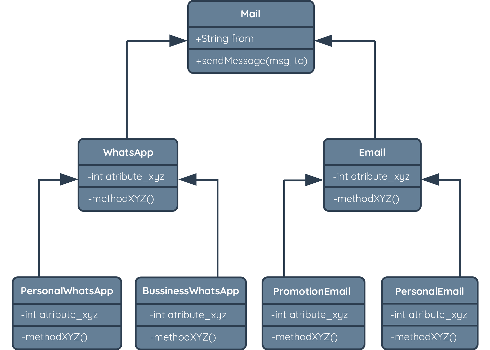

# Object Composition


Setelah konsep dari OOP kita pelajari, pasti sudah ada gambaran terkait dengan bagaimana
membuat sebuah Parent Class kemudian membuat berbagai Child Class yang mana mewarisi
sifat-sifat dari parent-nya, serta dapat menambahkan, mengubah, bahkan merombak setiap method
yang ada.

Sebuah paradigma OOP akan menghasilkan hierarki, di mana semakin besar software yang kita
buat, maka akan semakin besar dan rumit juga hierarkinya.



Coba bayangkan saja jika kita ingin membuat Child Class bernama PersonalEnterpriseWhatsApp di
mana blueprint kelas tersebut kita ingin menggunakan method dan attribute yang ada di
PersonalWhatsApp dan BussinessWhatsApp.  Kita perlu merombak kembali kelas-kelas parent-nya
hanya untuk membuat sebuah kelas baru. Nah, di sinilah pendekatan object composition
berperan.

Object composition adalah prinsip komposisi dari sebuah alur bisnis tanpa perlu melakukan
pewarisan dari parent class. Prinsip ini didasarkan pada kumpulan perilaku (method/function)
yang sudah kita definisikan. Sehingga, ketika ingin membuat alur bisnis lain dengan beberapa
perilaku (method) yang sama, kita dapat menggunakan fungsi yang sudah ada tanpa melakukan
inheritance/pewarisan.

Pada dasarnya konsep yang harus dilakukan adalah:

1. Memisahkan fungsi-fungsi umum yang biasa digunakan.

```javascript
const yourGenericAction = params => ({
  actionA: () => { /** do action A **/},
  actionB: () => { /** do action B **/},
});
```

2. Membuat Class seperti biasa.

```javascript
const YourClassName = (paramA, paramB) => {

}
```

3. Kita dapat menyimpan atribut yang kita punya ke dalam sebuah object, biasanya seorang
   engineer menggunakan konstanta dengan nama self atau state untuk menampung attribute.

```javascript
const YourClassName = (paramA, paramB) => {
  const self = {
    paramsA,
    paramsB
  };
}
```

4. Menambahkan perilaku (method/function) yang hanya ada pada kelas tersebut.

```javascript
const YourClassName = (paramA, paramB) => {
	const self = {
    paramsA,
    paramsB
	};
  
	const yourSpecificActions = self => ({
    	specificActinA: { /** do action A **/ },
	});

}
```

5. Membuat kumpulan attribute, generic method, dan spesific method menjadi satu objek.

```javascript
const YourClassName = (paramA, paramB) => {
  const self = {
    paramsA,
    paramsB
  };
  
  const yourSpecificActions = self => ({
    specificActinA: { /** do action A **/},
  });
  
  return Object.assign(self, yourGenericAction(self), yourSpecificActions(self))
}
```

Sebagai contoh, dari hirarki Mail yang sudah kita buat sebelumnya. kita akan merombak dan
membuatnya dengan pendekatan Object composition.

```javascript
// [1] list of abstractions
const canSendMessage = self => ({
    sendMessage: () => console.log('send message:', self.message)
  });

const checkIsValidPhone = self => ({
    isValid: () => console.log('valid phone', self.from)
  });

// [2] crate object composition
const personalEnterprise = (from, message, store) => {
  // [3] attributes
  const self = {
    from,
    message,
    store
  };
  // [4] method
  const personalEnterpriseBehaviors = self => ({
    createCatalog: () => console.log('Catalog has created: ', self.store)
  });
  
  // [5] create object composition
  return Object.assign(self, personalEnterpriseBehaviors(self), canSendMessage(self), checkIsValidPhone(self));
};

const pe1 = personalEnterprise('pengirim@gmail.com', 'hei produk baru nih', 'Dicoding Store');
pe1.createCatalog(); //Catalog has created:  Dicoding Store
pe1.sendMessage(); //send message: hei produk baru nih
```

Penjabaran kode di atas:

1. Kita membuat sebuah abstraksi untuk method-method yang umum digunakan (di sini misalkan
   method mengirim pesan, dan validasi nomor hp).

2. Kita membuat sebuah kelas baru dengan nama personalEnterprise, di mana seperti biasa kita
   dapat menggunakan parameter yang akan digunakan.

3. Pada  object composition ini, penggunaan parameter biasa digunakan untuk mendaftarkan
   attribute-attribute dari kelas tersebut. Pada contoh di atas, kita mengumpulkan attribute
tersebut pada konstanta bernama self atau state.

4. Method, kita dapat juga menambahkan method/fungsi yang spesifik hanya ada pada kelas
   tersebut (kapabilitasnya hanya pada kelas tersebut / tidak umum).

5. Proses pembuatan object dengan perintah Object.assign(attribute, method1, method2, methodN).

Dari contoh kode di atas maka kita dapat membuat sebuah object dengan nama `personalEnterprise`
tanpa harus melakukan pewarisan.


