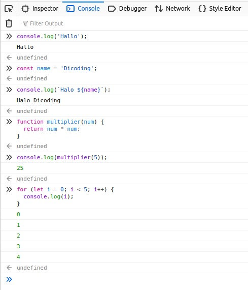

# JavaScript Runtime

Sesuai yang telah dijelaskan pada modul-modul awal, JavaScript mulanya hanya digunakan pada
lingkungan web browser. Saat ini pun browser masih merupakan lingkungan eksekusi yang paling umum
untuk kode JavaScript [4]. Lingkungan web browser memungkinkan kode JavaScript untuk menerima
inputan dari mouse dan keyboard pengguna. Selain itu, JavaScript juga dapat menampilkan output
kepada pengguna melalui HTML dan CSS.

Salah satu cara termudah untuk menjalankan kode JavaScript di lingkungan browser adalah menggunakan
browser itu sendiri. Kita dapat menggunakan developer tools yang disediakan oleh browser. Developer
tools bisa kita akses melalui shortcut ctrl + shift + i atau klik kanan -> Inspect Element. Setelah
itu pilih tab console. Developer tools ini dilengkapi dengan interpreter yang akan menjalankan kode
yang kita tulis.

Selain browser, terdapat runtime lain yang bisa menjalankan JavaScript, yaitu Node.js. Node.js
memungkinkan JavaScript dapat berjalan di berbagai platform, tidak hanya browser. Itulah kenapa
JavaScript yang awalnya terkenal sebagai bahasa untuk front-end web, kini mulai merambah juga ke
ranah back-end dari website.

Node memberikan akses JavaScript ke seluruh sistem operasi, memungkinkan program JavaScript dapat
membaca dan menulis file; mengirim dan menerima data melalui jaringan; serta membuat dan melayani
permintaan HTTP.

Selanjutnya kita akan fokus untuk pengembangan program JavaScript pada lingkungan Node. Tentunya
kita perlu menginstal Node.js terlebih dulu. Penasaran bagaimana caranya? Kita akan bahas pada
materi selanjutnya.
