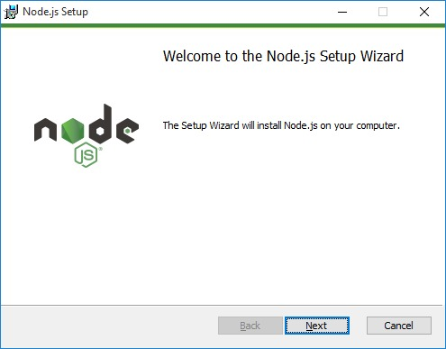

# Instalasi Node

Untuk bisa menjalankan Node pada perangkat lokal, kita perlu menginstal Node.js. Node.js memiliki
dua versi rilis, yaitu LTS dan current. LTS merupakan kepanjangan dari Long Term Support. Artinya,
versi tersebut mendapat dukungan dalam jangka waktu yang lama, sehingga lebih disarankan
menggunakan versi ini. Sementara, versi current berisi fitur-fitur baru yang dirilis untuk Node.js.


## Windows

Jika Anda menggunakan sistem operasi Windows, kunjungi situs https://nodejs.org/ lalu unduh Node.js
versi LTS.


Setelah berhasil mengunduh, buka berkas yang baru saja diunduh dan ikuti instruksi yang diberikan.



Jika Anda ingin mengubah lokasi instalasi, Anda bisa menentukan lokasi yang Anda inginkan.


Pada bagian selanjutnya, kita juga dapat melihat komponen apa saja yang akan diterapkan (bundling)
dalam pemasangan node.js ini.


Lalu ikuti instruksi selanjutnya dan tunggu proses instalasi hingga selesai. Jika instalasi selesai
dan berhasil, maka pesan seperti ini akan tampil.


## Mac

Jika Anda menggunakan MacOS, kunjungi situs https://nodejs.org/ kemudian unduh Node.js versi LTS.

Setelah berhasil mengunduh, silakan buka berkas tersebut dan ikuti instruksi yang diberikan

Jika ingin mengubah lokasi instalasi, Anda bisa menentukan lokasi yang diinginkan.

Tuliskan username dan password administrasi pada Mac Anda jika diperlukan.

Lalu tunggu proses instalasi selesai. Jika instalasi berhasil, maka akan menampilkan pesan seperti
ini:


## Linux

Jika Anda menggunakan Linux (Ubuntu), Anda dapat menginstal Node.js melalui terminal. Pastikan Anda
terkoneksi dengan internet. Silakan buka terminal dan tuliskan perintah berikut:

```bash
curl -fsSL https://deb.nodesource.com/setup_lts.x | sudo -E bash -
```

_NOTE: Jika Anda menggunakan linux versi lain, silakan lihat instruksi pemasangan Node.js pada
tautan berikut: https://github.com/nodesource/distributions/blob/master/README.md._

Jika terjadi eror, kemungkinan Anda belum memasang curl pada komputer Anda. Silakan instal curl
terlebih dulu dengan perintah berikut:

```bash
sudo apt-get install curl
```

Selanjutnya pasang Node.js dengan perintah berikut:

```bash
sudo apt-get install -y nodejs
```

Ikuti instruksi yang ada dan tunggu hingga proses selesai.

Untuk memastikan Node.js telah terpasang, jalankan dua perintah berikut pada terminal/command
prompt:


```bash
node -v
npm -v
```


Jika konsol menampilkan nomor versi, artinya Node.js dan NPM telah berhasil terinstal pada komputer
Anda.


