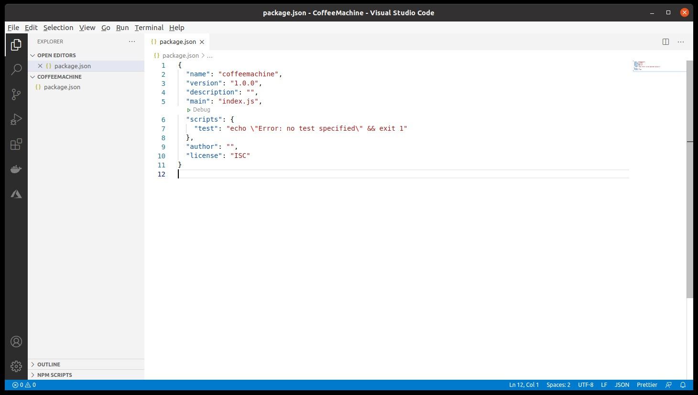

# Membuat Project JavaScript

Setelah berhasil menginstal text editor dan juga Node.js di komputer, artinya peralatan “perang”
kita sudah siap.

Sebenarnya kita bisa membuat berkas atau project JavaScript secara manual dengan membuat folder dan
meletakkan berkas berekstensi .js di dalamnya. Namun, untuk memudahkan pengembangan ke depannya,
kita akan membuat proyek menggunakan Node Package Manager (NPM). NPM digunakan untuk mengelola
package tambahan untuk mempermudah kita mengembangkan aplikasi. Akan ada modul tersendiri yang
membahas lebih rinci terkait NPM. Untuk saat ini, kita baru akan menggunakan NPM untuk membuat
proyek Node.js.

Pada direktori komputer Anda, buatlah folder baru sebagai folder utama dari proyek yang akan kita
buat. Di sini kita beri nama folder tersebut dengan “CoffeeMachine”. Kemudian buka folder tersebut
menggunakan Visual Studio Code. Anda dapat melakukannya dengan memilih menu File → Open Folder … →
Lalu pilih folder project Anda.


Lalu buka terminal/command prompt pada project tersebut dengan memilih menu Terminal → New
Terminal. Ketika terminal muncul jalankan perintah:

```bash
npm init
```
Selanjutnya Anda akan diberikan beberapa pertanyaan untuk mengisi nilai package name, version,
description, dsb. Semua itu merupakan informasi dasar tentang aplikasi yang kita buat.


Nilai yang berada di dalam tanda kurung merupakan nilai default. Jika nilai default tersebut sudah
cocok dengan yang diharapkan, kita dapat menggunakan nilainya dengan langsung menekan tombol enter.

Setelah mengisi seluruh pertanyaan yang diberikan, kita akan diminta untuk melihat dan
memverifikasi informasi yang akan disimpan.


Jika nilai yang ditampilkan sudah sesuai, tekan tombol enter. Nilai tersebut akan tersimpan dalam
berkas package.json. Jika, berkas package.json dibuka, hasilnya terlihat seperti gambar di bawah
ini.



Berkas tersebut digunakan untuk menyimpan informasi aplikasi yang kita buat. Untuk membuat berkas
package.json, sebenarnya kita dapat membuatnya sendiri layaknya membuat berkas baru pada umumnya.
Namun, cara tersebut bukan pendekatan yang baik. Dalam membuat berkas package.json, sebaiknya
gunakan perintah npm init pada Terminal di dalam project yang kita buat.


