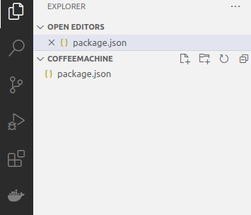
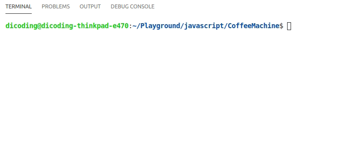
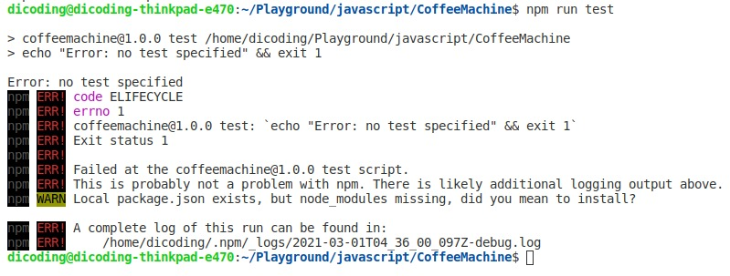
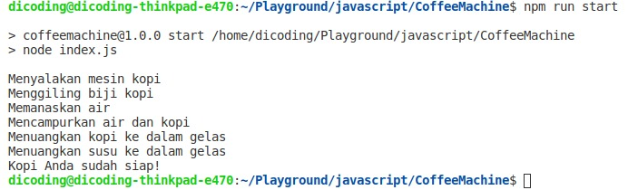

# Menjalankan Project Node

Pada modul sebelumnya kita telah tahu bagaimana membuat proyek Node.js. Sekarang kita akan mulai
menuliskan kode dan menjalankannya melalui terminal.

Pertama, buatlah berkas baru di dalam folder proyek Anda. Caranya, klik kanan pada daftar file yang
ada di Visual Studio Code lalu pilih New File. Beri nama berkas sesuai yang Anda masukkan pada
package.json (default-nya adalah index.js).



Pada berkas inilah kita bisa mulai menuliskan kode JavaScript. Sebagai permulaan, cetak sejumlah
proses pembuatan kopi dari mesin kopi kita. Tambahkan kode berikut ke dalam file index.js:

```javascript
console.log("Menyalakan mesin kopi");
console.log("Menggiling biji kopi");
console.log("Memanaskan air");
console.log("Mencampurkan air dan kopi");
console.log("Menuangkan kopi ke dalam gelas");
console.log("Menuangkan susu ke dalam gelas");
console.log("Kopi Anda sudah siap!");
```

Untuk menjalankan file JavaScript di atas juga cukup mudah, cukup jalankan perintah berikut pada
terminal:

```bash
node index.js
```

Node.js akan mengeksekusi setiap baris kode yang kita tulis lalu menampilkannya ke konsol terminal.




## Run Scripts

Pada berkas package.json terdapat beberapa object yang penting untuk kita perhatikan, salah satunya
adalah object scripts. Secara default object tersebut akan terbentuk ketika package.json dibuat
menggunakan perintah init. Nilai default dari scripts adalah seperti ini:


```javascript
 "scripts": {
    "test": "echo \"Error: no test specified\" && exit 1"
  },
```

Object scripts merupakan objek yang mengandung kumpulan script di dalamnya. Script tersebut dapat
dijalankan kapan saja pada proyek kita. Untuk menjalankan script, gunakan perintah `npm run <script-name>` yang dapat Anda tulis seperti di bawah ini:


```bash
npm run test
```

Dengan menjalankan script test, artinya kita mengeksekusi kode yang berada di dalam nilai test,
yaitu:

```javascript
"echo \"Error: no test specified\" && exit 1"
```

Sehingga, pada terminal akan menghasilkan output seperti berikut:



Pada object scripts biasanya kita menetapkan script yang sering digunakan secara berkala, seperti
menjalankan aplikasi (selama proses development), compiling source code ke tahap produksi, atau
melakukan testing.

Untuk menetapkan nilai baru pada object scripts, kita tuliskan nama script sebagai properti.
Kemudian tuliskan perintah yang akan dieksekusi sebagai nilai dari properti tersebut. Mari kita
buat script baru untuk menjalankan kode dari berkas index.js.

Pada object scripts, tuliskan nilai baru dengan properti bernama start, kemudian tambahkan perintah
untuk mengeksekusi berkas sebagai nilainya:

```javascript
  "scripts": {
    "test": "echo \"Error: no test specified\" && exit 1",
    "start": "node index.js"
  },
```

Kini kita bisa menjalankan program dengan perintah npm run start seperti di bawah ini




