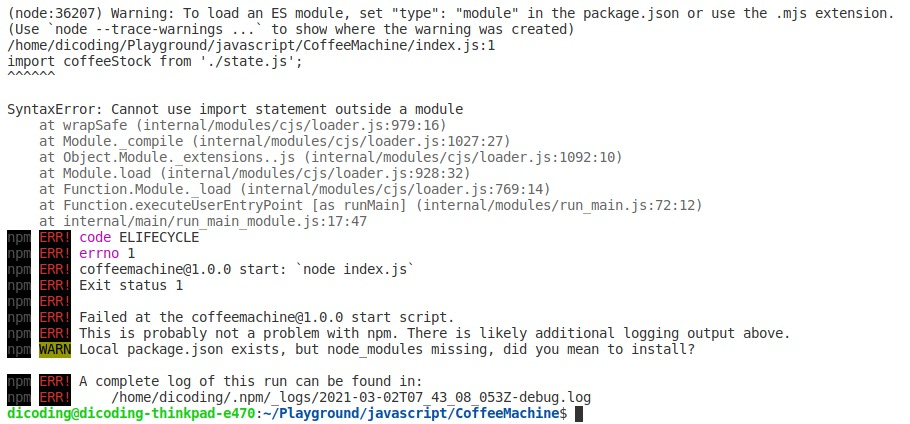

# ES6 Module

Untuk melakukan export dan import module JavaScript, ada dua cara yang bisa kita gunakan.
Sebelumnya kita telah mempelajari salah satu cara yaitu format CommonJS yang berjalan di lingkungan
Node.js. Sejak ES6, JavaScript memiliki sistem modular secara native. Karena itu, sistem ini dapat
dijalankan baik pada environment Node.js maupun browser.

Pada Node.js sebelumnya tidak ada perbedaan antara export satu atau beberapa nilai. Semua nilai
yang akan diekspor dijadikan nilai dari properti module.exports. Pada ES6 module, jika kita hanya
mengekspor satu nilai pada sebuah berkas JavaScript baik itu primitive value, function, array,
object, atau class, kita gunakan keyword export default. Contohnya seperti ini:

```javascript
const coffeeStock = {
    arabica: 100,
    robusta: 150,
    liberica: 200
};
 
export default coffeeStock;
```

Lalu untuk mengimpor nilainya kita dapat menggunakan keyword import … from seperti berikut ini:

```javascript
import coffeeStock from "./state.js";
```

Berbeda dengan gaya Node.js, kita gunakan keyword import ketika mendeklarasikan variabel yang
di-import. Kita juga menggunakan keyword from untuk menentukan lokasi berkas JavaScript-nya.

Ketika menggunakan export default, kita dapat menggunakan penamaan apa saja saat mendeklarasikan
variabel untuk menyimpan nilai yang diimpor.

```javascript
import stock from "./state.js";
```

Hal tersebut aman untuk dilakukan karena dengan menggunakan export default dapat dipastikan hanya
satu nilai yang diekspor pada satu berkas JavaScript.

Setelah kita berhasil mendapatkan nilai yang diekspor,kita dapat menggunakan nilainya layaknya
variabel lokal.

`index.js`
```javascript
import coffeeStock from './state.js';
 
const displayStock = stock => {
    for (const type in stock) {
        console.log(type);
    }
}
 
displayStock(coffeeStock);
```

`state.js`
```javascript
const coffeeStock = {
    arabica: 100,
    robusta: 150,
    liberica: 200

};
 
export default coffeeStock;
```

Sekarang jalankan kode di atas pada project Anda. Apakah muncul eror seperti berikut?



Jika iya, itu disebabkan karena berkas JavaScript yang kita buat tidak dianggap sebagai module.
Saat ini, fitur ES6 module tidak secara default diaktifkan. Pesan eror di atas menyebutkan dua cara
bagaimana mengaktifkan ES6 module. Dua cara tersebut adalah menambahkan properti pada package.json
atau dengan mengubah ekstensi .js menjadi .mjs. Mari kita gunakan cara pertama yang lebih
sederhana.

```javascript
{
  "name": "coffeemachine",
  "version": "1.0.0",
  "description": "",
  "main": "index.js",
  "type": "module",
  "scripts": {
    "test": "echo \"Error: no test specified\" && exit 1",
    "start": "node index.js"
  
  },
  "author": "",
  "license": "ISC"

}
```

Tambahkan properti `type` dengan nilai `module` pada berkas `package.json`. Lalu jalankan kembali program
Anda. Seharusnya Node.js sudah berjalan dengan baik dan menampilkan output seperti berikut:

```javascript
arabica
robusta
liberica
```

Jika sebelumnya kita hanya melakukan ekspor satu nilai pada berkas JavaScript menggunakan default
export, selanjutnya kita akan membahas bagaimana mengekspor banyak nilai dalam satu berkas
JavaScript menggunakan ES6.

Named export digunakan untuk mengekspor banyak nilai dalam berkas JavaScript. Cara kerjanya mirip
seperti pada Node.js. Nilai yang akan diekspor dituliskan di dalam object literals, seperti ini:

```javascript
const coffeeStock = {
    arabica: 100,
    robusta: 150,
    liberica: 200
};
 
const isCoffeeMachineReady = true;
 
export {coffeeStock, isCoffeeMachineReady};
```

Lalu untuk mendapatkan nilai yang diekspor melalui named export, kita gunakan destructuring object.

```javascript
import { coffeeStock, isCoffeeMachineReady } from './state.js';
 
console.log(coffeeStock);
console.log(isCoffeeMachineReady);
 
/* output
{ arabica: 100, robusta: 150, liberica: 200 }
true
*/
```

Karena named import menggunakan teknik destructuring object untuk mendapatkan nilai, maka pastikan
penamaan variabel sesuai dengan nama variabel yang diekspor. Jika nama tidak sesuai, akan terjadi seperti
berikut:

```javascript
import { stock, isCoffeeMachineReady } from './state.js';
 
/* output
SyntaxError: The requested module './state.js' does not provide an export named 'stock'
*/
```

Namun, jika kita tetap ingin mengubah penamaan variabel dari named import, kita bisa melakukannya dengan
menambahkan keyword as setelah penamaan variabelnya.

```javascript
import { coffeeStock as stock, isCoffeeMachineReady } from './state.js';
 
console.log(stock);
console.log(isCoffeeMachineReady);
 
/* output
{ arabica: 100, robusta: 150, liberica: 200 }
true
*/
```


